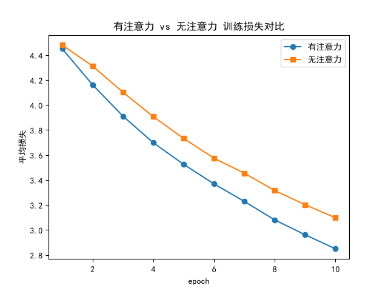
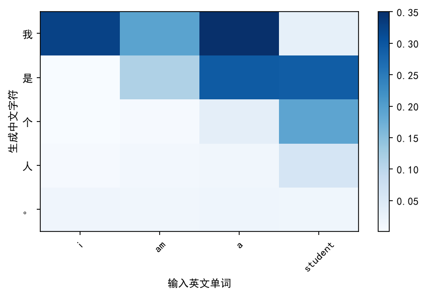
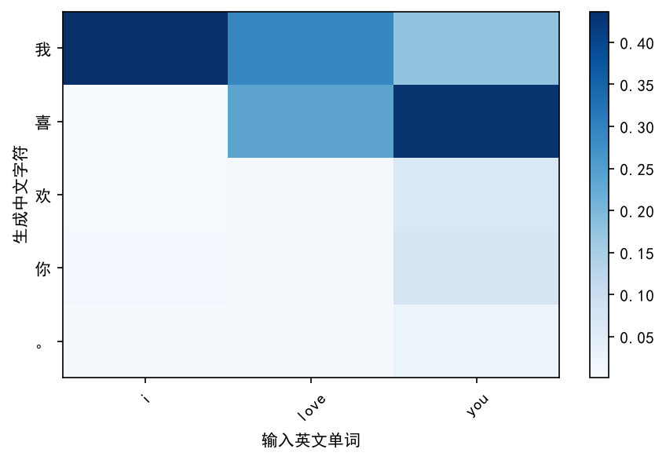

# 英译中 Seq2Seq 翻译模型

基于 PyTorch 实现的英→中机器翻译模型，采用 **GRU + 注意力机制（Attention）** 的 Seq2Seq 架构。

与英译法项目同架构，核心区别在于**中文采用字级（character-level）切分**：每个汉字（含标点）当作一个 token，因为中文没有空格分词。

## 功能

- 英文清洗（转小写、标点归一）+ 中文逐字切分
- GRU 编码器（`EncoderRNN`）
- 带注意力机制的 GRU 解码器（`AttentionDecoderRNN`）
- 教师强制（Teacher Forcing）训练
- 损失曲线可视化
- 模型加载与推理

## 项目结构

```
英译中项目/
├── train.py                 # 训练入口：调用 training.trainer 的 train_seq2seq()
├── predict.py               # 推理入口：调用 evaluation.predict 的 dm_test_seq2seq()
├── ablation.py              # 消融实验：有注意力 vs 无注意力 对比训练 + 损失曲线 + 翻译样例对比
├── visualize.py             # 注意力可视化：绘制「英文词 ↔ 中文字符」注意力热力图
├── config.py                # 常量（SOS/EOS/MAX_LENGTH）、超参数（学习率/轮数/教师强制比）、设备与权重路径
├── requirements.txt         # 依赖清单（PyTorch、matplotlib、tqdm）
├── data_utils/
│   ├── preprocess.py        # 数据清洗（英文小写+标点、中文去空白）+ 逐字切分 + 构建词表
│   └── dataset.py           # MyPairsDataset 数据集 + get_dataloader 加载器（batch_size=1）
├── models/
│   ├── encoder.py           # EncoderRNN：Embedding + GRU 编码器，输出序列特征与最终隐藏状态
│   ├── decoder.py           # DecoderRNN：无注意力的基础 GRU 解码器（消融对比用）
│   └── attention_decoder.py # AttentionDecoderRNN：带注意力机制的 GRU 解码器
├── training/
│   └── trainer.py           # 训练循环：train_iters 单步训练（教师强制）+ train_seq2seq 主循环
├── evaluation/
│   └── predict.py           # evaluate_seq2seq 贪心解码 + dm_test_seq2seq 样例推理
├── data/
│   ├── cmn-eng_10000.txt    # 处理好的 10000 句中英平行句对（英文\t中文）
│   └── raw/                 # 原始语料（未提交）
├── checkpoints/             # 模型权重 .pth（不提交，train.py 可重新生成）
└── img/                     # 损失曲线图（plot_loss_*）+ 注意力热力图（attention_*）
```

## 数据

- **来源**：Tatoeba 的 cmn-eng 中英平行语料（[manythings.org](https://www.manythings.org/anki/)）
- **处理**：从 32028 句对中随机抽取 10000 句，过滤掉不含汉字或过长的句子
- **词表规模**：英文 4562 词，中文 2943 字
- **切分方式**：英文按空格分词，中文逐字切分（如「我是学生」→ 我/是/学/生）
- ⚠️ 注意：Tatoeba 中文含少量繁体（如「沒有」），字级模型会把繁、简体当作不同字符处理

## 环境依赖

- Python 3.8+
- PyTorch
- matplotlib
- tqdm

```bash
pip install -r requirements.txt
```

> GPU 加速请到 [pytorch.org](https://pytorch.org) 按 CUDA 版本安装；仅 CPU 可 `pip install torch`。

## 训练

```bash
python train.py
```

- 每个 epoch 结束后把权重保存到 `checkpoints/my_encoder_rnn_{epoch}.pth` 和 `checkpoints/my_attn_decoder_{epoch}.pth`
- 每 100 个 batch 记录一次平均损失，绘制损失曲线到 `img/plot_loss_{epoch}.png`

## 推理

```bash
python predict.py
```

默认加载 `checkpoints/` 下第 5 个 epoch 的权重，对内置示例句子做英译中并打印结果。

> 注意：`checkpoints/` 已被 `.gitignore` 忽略，克隆后需先运行 `train.py` 生成权重，再运行 `predict.py`。

## 训练结果

### 损失曲线

「有注意力」vs「无注意力」两种模型在同一份数据上的训练损失对比：



各 epoch 的损失曲线见 `img/plot_loss_*.png`。

### 注意力可视化

带注意力解码器在生成每个中文字符时，对输入英文单词的注意力权重热力图（颜色越亮表示越关注）：

| i am a student | i love you |
| --- | --- |
|  |  |

> 由 `visualize.py` 生成，展示「生成中文字符 ↔ 输入英文单词」的对齐关系。

## 配置

所有常量、超参数和路径集中在 `config.py`：

| 配置项 | 含义 | 默认值 |
| --- | --- | --- |
| `MAX_LENGTH` | 最大句子长度 | 100 |
| `my_lr` | 学习率 | 1e-4 |
| `epochs` | 训练轮数 | 10 |
| `teacher_forcing_ratio` | 教师强制概率 | 0.5 |
| `print_interval_num` | 打印间隔（batch） | 1000 |
| `plot_interval_num` | 绘图间隔（batch） | 100 |
| `PATH1` / `PATH2` | 推理加载的权重路径 | 第 5 个 epoch |
